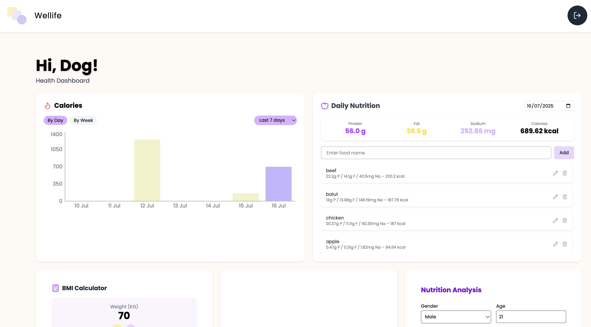
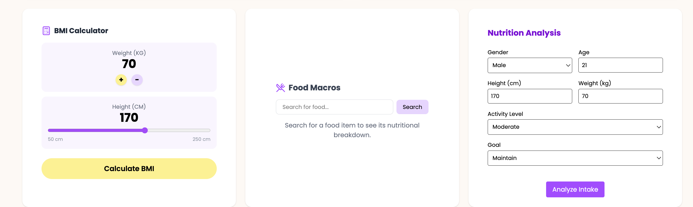
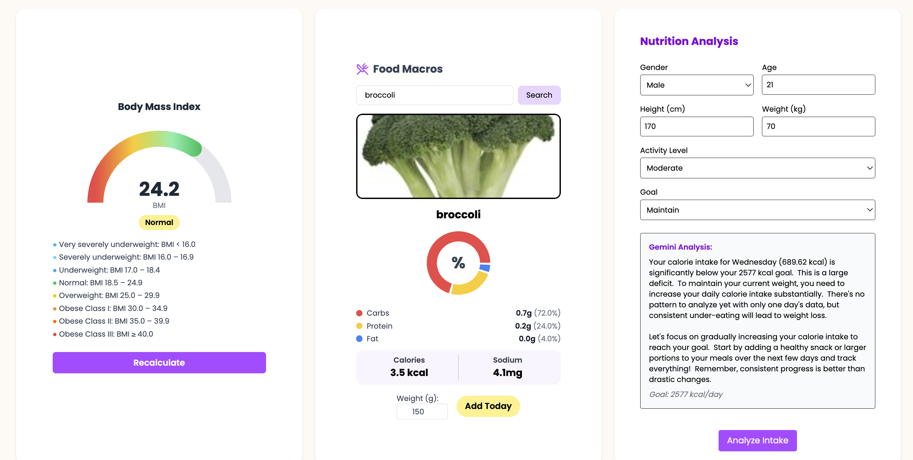

# Wellife: Personal Nutrition Tracker

Wellife is a full-stack nutrition tracking web app that empowers users to monitor their daily food intake, visualize macro and calorie trends, calculate BMI, and receive AI-generated dietary feedback. Built with React, Tailwind CSS, Express.js, MongoDB, and Nutritionix + Gemini AI APIs.

---

##  Features

- **Daily Food Logging**: Enter food by name and retrieve nutrition data using Nutritionix API.
- **Macro Summaries**: See daily totals for protein, fat, sodium, and calories.
- **Calorie Chart**: Adjustable calorie trend visualization.
- **BMI Calculator**: Animated gauge showing real-time BMI with category labels.
- **AI Nutrition Analyzer**: Get personalized dietary analysis using Gemini AI.
- **Editable Entries**: Modify or delete saved food items.
- **Secure Auth**: Register/login with hashed passwords and JWT-based authentication.

---

## What I Learned

Throughout building this project, I learned how to:

- Structure a full-stack app using the **MERN** stack.
- Use **forward refs** and `useImperativeHandle()` in React to trigger child methods from the parent.
- Work with **external APIs** (Nutritionix, Gemini) and handle asynchronous operations and errors gracefully.
- Animate SVGs and build **interactive components** like the BMI gauge.
- Protect routes with **JWT authentication** and set up secure login flows.
- Build a clean and responsive UI with **Tailwind CSS**
- Learnt how to **send and receive data** between frontend and backend using Axios
- Learnt to build reusable React components and **manage state** using useState and useEffect hooks.

---

## 📸 Screenshots

### Login & Register
| Login | Register |
|-------|----------|
|  |  |

### Dashboard Overview
| Top Section (Chart + Summary) | Bottom Section (BMI + Search + AI) |
|-------------------------------|----------------------------|
|  |  |

### After Analysis / Interaction
| After BMI, Food Search & AI Analysis |
|----------------------------------|
|  |

---

## 🛠️ Tech Stack

### Frontend
- React
- Tailwind CSS
- Axios
- React Router DOM
- SweetAlert2
- Lucide React Icons

### Backend
- Node.js + Express.js
- MongoDB + Mongoose
- JWT for authentication
- Nutritionix API
- Gemini / OpenAI API

---

## 🚀 Installation

### 1. Clone the repository

```bash
git clone https://github.com/your-username/wellife-nutrition-tracker.git
cd wellife-nutrition-tracker
```

### 2. Install dependencies

```bash
cd frontend
npm install

cd ../backend
npm install
```

### 3. Environment variables

Create a `.env` file in the `/backend` directory:

```
MONGO_URI=your_mongo_connection_string
JWT_SECRET=your_jwt_secret
NUTRITIONIX_APP_ID=your_nutritionix_app_id
NUTRITIONIX_API_KEY=your_nutritionix_api_key
OPENAI_API_KEY=your_openai_or_gemini_key
```

### 4. Run the project

```bash
# In one terminal
cd backend
npm run dev

# In another terminal
cd frontend
npm run dev
```

---

## Project Structure

```
frontend/
  components/
    Navbar.jsx
    FoodSummary.jsx
    BMICard.jsx
    CalorieChart.jsx
    FoodPreviewCard.jsx
    NutritionAnalyzer.jsx
  pages/
    Dashboard.jsx
  utils/
    axios.js

backend/
  models/
    FoodEntry.js
  routes/
    nutrition.js
    auth.js
    analyze.js
  middleware/
    authMiddleware.js
  index.js
```

---

## API Endpoints

### Nutrition

* `POST /api/nutrition` – Add food
* `GET /api/nutrition` – Get foods by date
* `PATCH /api/nutrition/:id` – Edit food
* `DELETE /api/nutrition/:id` – Delete food

### Analyze

* `POST /api/analyze` – Submit daily macros for AI analysis

### Auth

* `POST /api/auth/register` – Create account
* `POST /api/auth/login` – Login and receive token

---

## Author

Built by SAMTAN444
Feel free to get in touch with me at samueltjy13@gmail.com